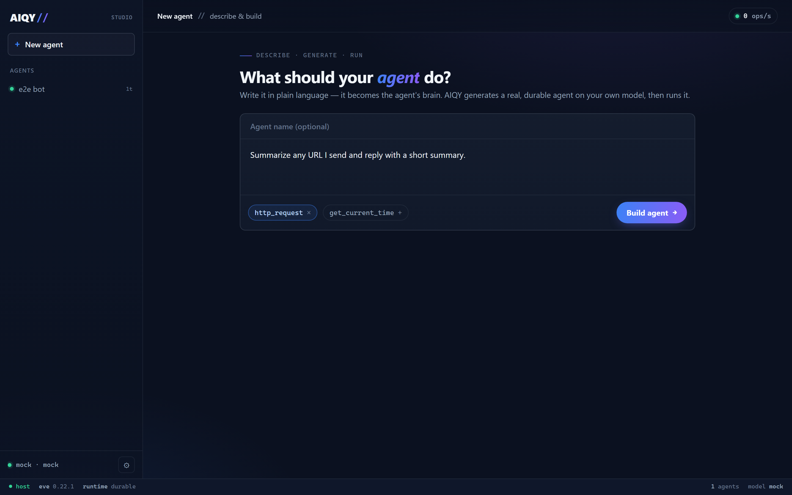
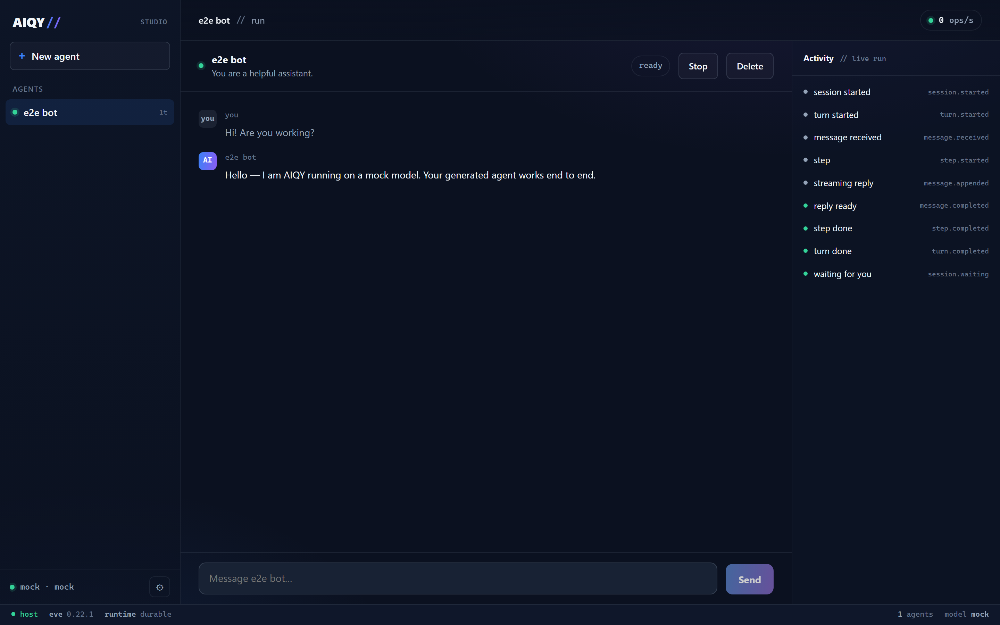
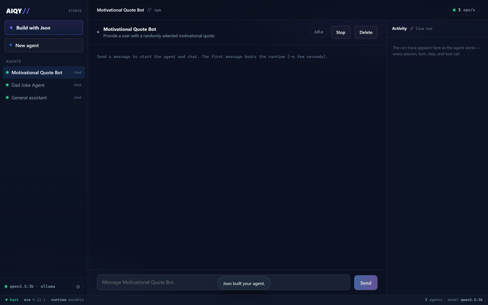
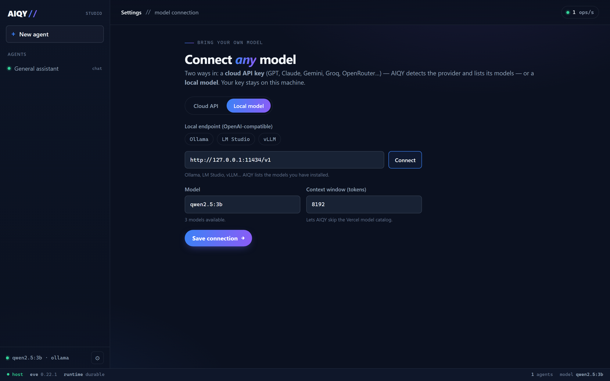

# AIQY //

**Describe an agent in plain language — AIQY builds and runs a real, durable AI agent on _your own_ model.**

AIQY is an open-source, self-hostable studio for building AI agents. You write what
the agent should do, pick a few tools, and AIQY generates a real agent, compiles it,
and runs it — all on a model _you_ connect (any OpenAI-compatible endpoint, including
local Ollama / LM Studio / vLLM). No cloud lock-in, no keys leaving your machine.

Under the hood AIQY builds on [**Eve**](https://github.com/vercel/eve), Vercel's
open-source agent framework, and reuses its durable runtime, sandbox, and channels —
so AIQY focuses on the layer Eve doesn't have: a visual, model-agnostic builder for
everyone, not just developers.

Or just **talk to Json** — a chat-first builder that designs the agent, writes the tool
code itself (compiling and self-correcting until it works), and builds it while you
describe what you want.



---

## Why AIQY

- **Bring your own model.** Any OpenAI-compatible endpoint — local or cloud. AIQY runs
  entirely outside the Vercel AI Gateway (the thing that normally ties Eve to Vercel).
- **Real agents, not toy flows.** Every agent is a genuine Eve project with durable
  execution, tools, and a running HTTP endpoint — generated as inspectable files.
- **Instant.** Dependencies install once; each new agent is just files, created in an
  instant.
- **Self-hosted & private.** Runs on your machine. Your model, your keys, your data.
- **Open source.** MIT licensed. Fork it, extend it, ship it.

## Quickstart

Requirements: **Node.js ≥ 24**.

```bash
cd aiqy
npm install
npm run dev
# open http://localhost:4300
```

1. **First run** installs a shared Eve runtime once (~30s).
2. Open **Settings** and point AIQY at a model — e.g. Ollama:
   `http://127.0.0.1:11434/v1`, model `llama3.1`. (Presets included.)
3. On **New agent**, describe what it should do, pick tools, hit **Build agent**.
4. Chat with it. Done.

## How it works

```
┌──────────────────────────────────────────────────────────┐
│  AIQY (Next.js, single-user, self-hosted)                 │
│  • Settings (BYO model)  • Builder  • Agents + chat        │
│  • Agent Manager: one `eve dev` process per agent,         │
│    proxied at /api/agents/:id/eve/**                       │
└───────────────┬───────────────────────────┬──────────────┘
                │ generates files            │ proxies HTTP
        ┌───────▼────────┐          ┌────────▼─────────┐
        │ Generator      │          │ Generated agent  │  (Eve project,
        │ (spec → files) │          │  running on your │   BYO model,
        │ + validator    │          │  model)          │   durable runtime)
        └────────────────┘          └──────────────────┘
```

- **Generator** (`lib/generator.ts`) writes a complete Eve agent from a spec. The model
  is configured via a baked `defineAgent({ model: createOpenAICompatible(...), modelContextWindowTokens })`
  — the `modelContextWindowTokens` is what lets Eve skip the Vercel model catalog and use
  any endpoint.
- **Validator** (`lib/validate.ts`) runs `eve info --json` and returns a structured verdict.
- **Agent Manager** (`lib/agent-manager.ts`) spawns and supervises one `eve dev` process
  per agent and proxies its HTTP API.
- **Chat client** (`lib/eve-client.ts`) drives an Eve session (POST create + NDJSON stream).

Generated agents and settings live under `.data/` (gitignored).

## Tool library

The built-in Eve framework tools (`web_fetch`, `web_search`, `bash`, `read_file`,
`write_file`, …) are available to every agent for free. AIQY adds a small curated
library for the gaps (`lib/tool-library.ts`): `http_request` (call any API),
`get_current_time`, and more to come.

## Roadmap

- [x] Bring-your-own-model (local + cloud), builder, run/chat, self-correct validation.
- [ ] AI-assisted builder — turn a one-liner into instructions + tool selection.
- [ ] Studio — a visual run dashboard (session/turn/step waterfall + token/cost).
- [ ] More channels (Slack, Telegram, WhatsApp, email) and a one-command Docker deploy.

## Security

AIQY is a **single-user, self-hosted** tool. Its security model:

- **Your keys stay local.** API keys live only under `.data/` (gitignored, never
  committed) and are injected into agents at runtime via the process environment — they
  are **never written into an agent's source files**.
- **Generated tool code is real code.** Agents (and Json) can generate tools whose
  `execute()` runs in the agent's Node process with your user's permissions. Build and
  run only agents you trust — treat it like running code you wrote.
- **Nothing is exposed by default.** AIQY listens on localhost and agents run as local
  processes. If you deploy it beyond your own machine, add authentication and isolate the
  agent processes (e.g. one container per agent).

## Screenshots

| Run + live trace | Talk to Json | Connect any model |
| --- | --- | --- |
|  |  |  |

## Built on Eve

AIQY is an independent open-source project built on top of
[Eve](https://github.com/vercel/eve) by Vercel (Apache-2.0). It uses Eve as a
dependency and does not redistribute Eve's source. "Eve" and "Vercel" are
trademarks of Vercel, Inc.; AIQY is not affiliated with or endorsed by Vercel.
See [`NOTICE`](./NOTICE).

## License

MIT — see [`LICENSE`](./LICENSE).
